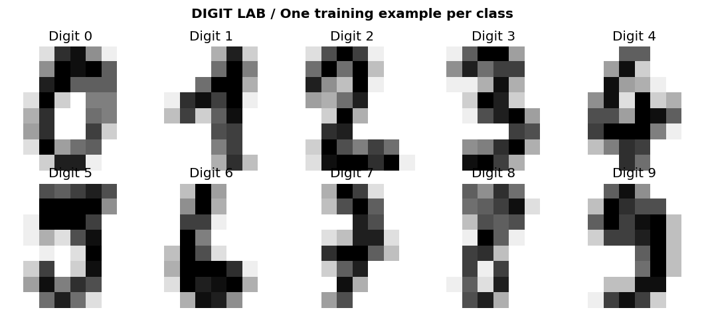
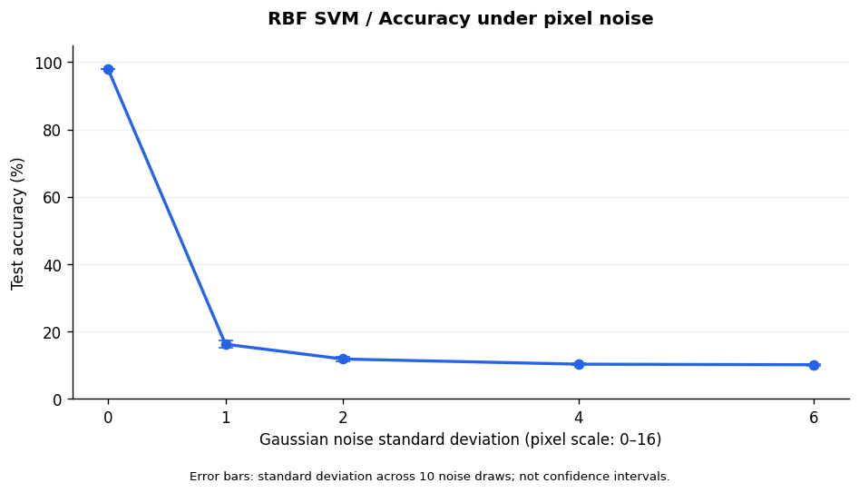
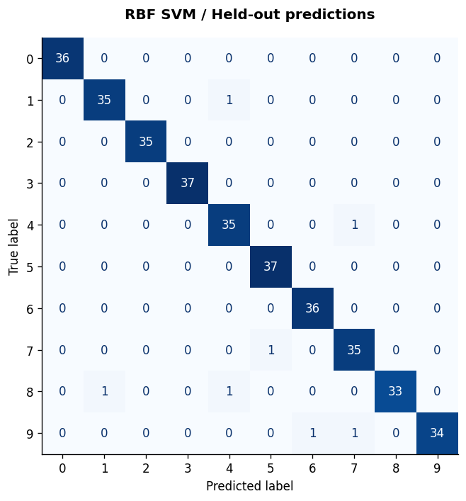
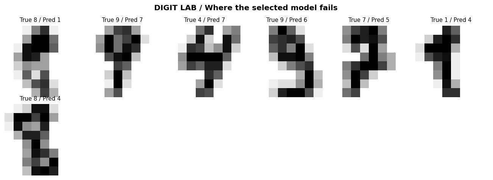

# Digit Lab

### Small images. Simple models. Honest evaluation.

A beginner machine learning experiment: recognize handwritten digits, inspect mistakes, and test what happens when the pixels become noisy.

**Status:** runnable AI-assisted starter, with recorded outputs. The initial implementation, explanations, and execution were prepared with ChatGPT. Personal follow-up experiments are not yet completed.



## Research question

How do Logistic Regression and an RBF Support Vector Machine compare on small handwritten digit images, and does high clean-image accuracy imply robustness to noise?

## Recorded results

| Model | Training CV accuracy | Held-out accuracy | Macro F1 | Correct |
|---|---:|---:|---:|---:|
| Dummy baseline | 10.09% ± 0.02% | 10.00% | 0.0182 | 36/360 |
| Logistic Regression | 96.80% ± 0.74% | 97.22% | 0.9719 | 350/360 |
| RBF SVM | 98.12% ± 0.52% | 98.06% | 0.9805 | 353/360 |

The RBF SVM was selected using the highest mean accuracy across five training-only validation folds, before inspecting the held-out results. The ± values are fold standard deviations, not confidence intervals. This is one fixed split, not a claim about all handwriting.

The selected SVM made **7 errors out of 360 held-out images**. With Gaussian noise of standard deviation 1 on the 0–16 pixel scale, its accuracy fell to **16.25% on average across ten noise draws**. At standard deviation 6 it was **10.17%**.

**Interpretation:** this particular preprocessing/model combination is fragile under the tested corruption. A hypothesis to investigate is that per-pixel standardization amplifies noise in nearly constant background pixels. In the training split, six pixels have a positive standard deviation below 0.1; the smallest is about 0.0264. This observation motivates a follow-up; it does not establish the full cause or show that every SVM behaves this way.



## Method

1. Load the 1,797 images bundled with `sklearn.datasets.load_digits`.
2. Flatten each 8 × 8 image into 64 pixel values.
3. Reserve a stratified 20% holdout: 1,437 training images and 360 test images, seed 42.
4. Compare a most-frequent-class baseline, Logistic Regression (`C=1`), and RBF SVM (`C=3`, `gamma="scale"`) using five-fold stratified training cross-validation.
5. Fit scalers inside the pipelines to avoid validation leakage. Refit each fixed pipeline on all training data and report the same held-out set.
6. Inspect errors for the CV-selected model. Keep it frozen for the synthetic noise experiment: sigma 0, 1, 2, 4, 6; ten fixed draws per level; clip pixels to [0, 16]. At sigma 0 the ten draws are identical.

## Run it

### Easiest: Google Colab

Open [Google Colab](https://colab.research.google.com/), upload `digit_lab.ipynb`, and run all cells in order. The notebook is self-contained and includes saved outputs. Colab normally includes the required libraries; installed versions can differ from the recorded run. It creates `results/` in the active runtime. Download anything you want to retain before closing the runtime.

### Local Python

Use Python 3.11 or 3.12. In a terminal opened inside this project folder:

```bash
python -m pip install -r requirements.txt
python train.py
```

The script writes results without requiring a display. The dataset is included with scikit-learn, so no separate data download or API key is needed. Package installation requires internet access. Exact tested package versions are pinned in `requirements.txt`; execution versions and split indices are saved in `results/run_metadata.json`.

## Files

| File | Purpose |
|---|---|
| `digit_lab.ipynb` | Step-by-step English notebook, with executed outputs |
| `train.py` | The same experiment as a Python script |
| `requirements.txt` | Tested package versions |
| `START_HERE_VI.md` | Vietnamese setup, learning guide, and GitHub upload steps |
| `EXPERIMENT_LOG.md` | Blank log for your own follow-up work |
| `results/metrics.csv` | Validation and test scores |
| `results/predictions.csv` | Auditable held-out labels and predictions |
| `results/classification_report.json` | Per-class precision, recall, and F1 |
| `results/noise_robustness.csv` | Noise experiment summary |
| `results/run_metadata.json` | Seed, versions, selected model, and split indices |
| `results/*.png` | Example images, confusion matrix, mistakes, and noise curve |

## Error analysis

Rows of the confusion matrix are true digits; columns are predicted digits. Inspect the actual error images before proposing shape-based explanations.





## Next experiment: your contribution

Compare the existing standardization with dividing pixels by the fixed maximum 16. Predict the outcome before running it. Evaluate model choices on training-only validation data. Because the existing held-out noise results have now been inspected, label further comparisons on that same set **exploratory**, or collect/reserve genuinely new data for a confirmatory evaluation. Record the change, results, and limitations in `EXPERIMENT_LOG.md`.

## Limits

- This uses a small educational dataset, not MNIST and not an application that reads phone photographs.
- The bundled subset is split anew; it does not reproduce the original UCI benchmark split.
- A random image split may share writers between partitions. Writer-independent performance is not measured.
- Gaussian pixel noise is a synthetic stress test, not a complete model of real handwriting or camera noise.
- Ten noise draws measure variation in corruption on this one held-out set, not uncertainty across populations or training runs.
- Strong clean-image performance does not prove deployment readiness.

## Data and attribution

The project loads the dataset through [scikit-learn's `load_digits`](https://scikit-learn.org/stable/modules/generated/sklearn.datasets.load_digits.html). The source is [Optical Recognition of Handwritten Digits](https://archive.ics.uci.edu/dataset/80/optical+recognition+of+handwritten+digits), E. Alpaydin and C. Kaynak (1998), UCI Machine Learning Repository, [DOI: 10.24432/C50P49](https://doi.org/10.24432/C50P49), licensed under [CC BY 4.0](https://creativecommons.org/licenses/by/4.0/). Example and error images are derived from that dataset; noise experiments modify pixel values. Dataset attribution applies independently of project code.

Initial code and documentation were generated with ChatGPT and executed in the assistant's environment. Review, rerun, and document your own work before describing personal contributions to this project.
